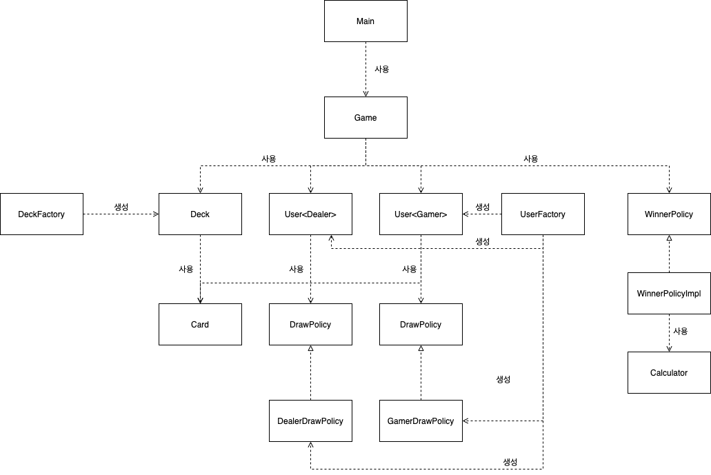

# black-jack

### 블랙잭 규칙
1) 딜러와 게이머 단 2명만 존재한다.
2) 카드는 조커를 제외한 52장이다. (즉, 카드는 다이아몬드,하트,스페이드,클럽 무늬를 가진 A,2~10,K,Q,J 으로 이루어져있다.)
3) 2~10은 숫자 그대로 점수를, K/Q/J는 10점으로, A는 1로 계산한다. (기존 규칙은 A는 1과 11 둘다 가능하지만 여기선 1만 허용하도록 스펙아웃)
4) 딜러와 게이머는 순차적으로 카드를 하나씩 뽑아 각자 2개의 카드를 소지한다.
5) 게이머는 얼마든지 카드를 추가로 뽑을 수 있다.
6) 딜러는 2카드의 합계 점수가 16점 이하이면 반드시 1장을 추가로 뽑고, 17점 이상이면 추가할 수 없다.
7) 양쪽다 추가 뽑기 없이, 카드를 오픈하면 딜러와 게이머 중 소유한 카드의 합이 21에 가장 가까운 쪽이 승리한다.
8) 단 21을 초과하면 초과한 쪽이 진다.


### 기능 구현
1) [ ] Card
2) [ ] Deck
3) [ ] Dealer
4) [ ] Gamer
5) [ ] Game

### 전체적인 게임의 흐름
1. 딜러와 게이머와 각각 2장씩 카드를 뽑는다
2. 딜러는 16점 이하라면 카드를 하나 더 뽑는다
3. 게이머는 자신이 뽑고 싶은 만큼 카드를 더 뽑는다
4. 승자를 출력하고 끝난다

### 패키지 구성
패키지는 도메인과 역할별로 구성을 하였다
- `card` : Card 도메인과 관련된 클래스들이 모여있다
- `policy` : 카드 뽑기나 승자를 판별하는 정책이 모여있다
- `user` : User(Dealer, Gamer)와 UserFactory가 있다
- `util` : 유틸관련한 클래스들이 모여있다
- `root` : Game과 Main 클래스가 있다
```
root
  | Main.java
  | Game.java
  |
  |____card
  |      | Card.java
  |      | Deck.java
  |
  |____policy
  |      | DrawPolicy<interface>.java
  |      | DealerDrawPolicy.java
  |      | GamerDrawPolicy.java
  |      | WinnerPolicy<interface>.java
  |      | WinnerPolicyImpl.java
  | 
  |____user
  |      | User.java
  |      | UserFactory.java
  |       
  |____util
         |Caculator.java
```

### 클래스 사용관계 다이어그램  

